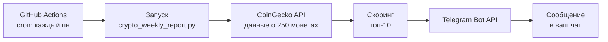

# Crypto Weekly Report 📊

Скрипт, который раз в неделю отправляет в Telegram топ-10 криптовалют
по комбинированному скорингу (капитализация + объём + рост за 7 дней).

Работает **в облаке GitHub Actions** — ваш компьютер может быть выключен.

---

## Как это работает



---

## Быстрый старт (5 шагов)

### Шаг 1. Создайте Telegram-бота

1. Откройте Telegram, найдите **@BotFather**.
2. Отправьте `/newbot`.
3. Придумайте имя и username (заканчивается на `bot`).
4. Скопируйте **токен** вида `1234567890:ABCdef...`.

### Шаг 2. Узнайте свой Chat ID

1. Напишите вашему боту любое сообщение (`/start`).
2. Найдите бота **@userinfobot**, отправьте `/start`.
3. Он пришлёт ваш **ID** (число, например `123456789`).

> Бот не может писать первым — сначала напишите ему вы.

### Шаг 3. Создайте репозиторий на GitHub

1. Зайдите на https://github.com/new
2. Имя репозитория: `crypto-weekly-report` (или любое).
3. Тип: **Private** (рекомендуется) или Public.
4. **Не** добавляйте README/gitignore — они уже есть в проекте.
5. Нажмите **Create repository**.

### Шаг 4. Загрузите файлы

**Вариант А — через веб-интерфейс (проще):**

1. На странице репозитория нажмите **Add file → Upload files**.
2. Перетащите **все файлы и папки** проекта, включая скрытую папку `.github`.

- В Windows: включите отображение скрытых файлов (Вид → Показать → Скрытые элементы).
- Файл `.env` загружать **НЕ НУЖНО** (его и не должно быть в проекте).
3. Внизу нажмите **Commit changes**.

**Вариант Б — через командную строку:**

```
git init
git add .
git commit -m "Initial commit"
git branch -M main
git remote add origin https://github.com/ВАШ_ЛОГИН/crypto-weekly-report.git
git push -u origin main
```

> Убедитесь, что `.env` **не** попал в коммит. Проверка: `git status` — файла `.env` быть не должно.

### Шаг 5. Добавьте секреты

1. В репозитории: **Settings → Secrets and variables → Actions**.
2. Нажмите **New repository secret**.
3. Создайте два секрета:

| Name | Value |
|---|---|
| `TELEGRAM_BOT_TOKEN` | токен из Шага 1 |
| `TELEGRAM_CHAT_ID` | ID из Шага 2 |

⚠️ Имена должны совпадать **точно** (регистр важен).

---

## Проверка

1. Перейдите на вкладку **Actions** в репозитории.
2. Слева выберите workflow **Weekly Crypto Report**.
3. Справа нажмите **Run workflow → Run workflow**.
4. Через 20–40 секунд появится запуск. Кликните на него.
5. Если всё ок — в Telegram придёт сообщение, а в логах будет `Сообщение успешно отправлено`.

---

## Расписание

По умолчанию отчёт приходит **каждый понедельник в 10:00 МСК**.

Изменить можно в файле `.github/workflows/weekly-report.yml`:

```
on:
  schedule:
    - cron: '0 7 * * 1'
```

**Cron в GitHub Actions работает по UTC.** Расшифровка:

```
 ┌──────── минута (0-59)
 │ ┌────── час (0-23, UTC)
 │ │ ┌──── день месяца (1-31)
 │ │ │ ┌── месяц (1-12)
 │ │ │ │ ┌ день недели (0-7, где 0 и 7 = воскресенье)
 │ │ │ │ │
 0 7 * * 1
```

Примеры:

| Cron ↕▾ | Когда (UTC) ↕▾ | Когда (МСК, UTC+3) ↕▾ |
|---|---|---|
| −`0 7 * * 1` | Пн 07:00 | Пн 10:00 |
| −`0 7 * * 5` | Пт 07:00 | Пт 10:00 |
| −`0 18 * * 0` | Вс 18:00 | Вс 21:00 |
| −`0 7 1 * *` | 1-е число месяца | 1-е число, 10:00 |
⚙

> **Важно:** GitHub может запускать cron с задержкой до 15–30 минут
> при высокой нагрузке на их серверы. Это нормально.

---

## Настройка скоринга

В `crypto_weekly_report.py`:

| Параметр ↕▾ | Описание ↕▾ | По умолчанию ↕▾ |
|---|---|---|
| −`WEIGHT_MARKET_CAP` | Вес капитализации | `0.40` |
| `WEIGHT_VOLUME` | Вес объёма торгов | `0.30` |
| `WEIGHT_CHANGE_7D` | Вес роста за 7 дней | `0.30` |
| `MIN_MARKET_CAP` | Мин. капитализация | `50_000_000` |
| `MIN_VOLUME` | Мин. объём | `1_000_000` |
| `EXCLUDE_STABLECOINS` | Исключать стейблы | `True` |
⚙

---

## Локальный запуск (опционально)

Если хотите запускать и на своём ПК тоже:

1. Скопируйте `.env.example` → `.env`, заполните токены.
2. Установите зависимости: `pip install -r requirements.txt`
3. Запустите: `python crypto_weekly_report.py`

Для автоматизации на Windows используйте **Task Scheduler** (см. ниже)
или просто запускайте `run_local.bat` вручную.

### Настройка Task Scheduler (Windows)

1. `Win + R` → `taskschd.msc` → Enter.
2. Справа: **Создать задачу**.
3. **Общие**: имя `Crypto Weekly Report`.
4. **Триггеры → Создать**: еженедельно, нужный день и время.
5. **Действия → Создать**:

- Программа: полный путь к `python.exe` (`where python` в cmd).
- Аргументы: полный путь к `crypto_weekly_report.py`.
- Рабочая папка: папка проекта.
6. **ОК**.

---

## Частые проблемы

| Проблема ↕▾ | Причина / Решение ↕▾ |
|---|---|
| −Actions падает с `KeyError` или пустым токеном | Секреты названы неверно. Проверьте: `TELEGRAM_BOT_TOKEN` (не `BOT_TOKEN`). |
| `Ошибка отправки в Telegram: 400` | Неверный Chat ID или бот не получал сообщений от вас. Напишите боту `/start`. |
| `Ошибка запроса к CoinGecko: 429` | Лимит запросов. Повторите запуск через минуту. |
| Workflow не появился во вкладке Actions | Папка `.github/workflows/` не загрузилась. Проверьте структуру репозитория. |
| Отчёт не приходит по расписанию | Проверьте, что workflow включён (Actions → выбрать → Enable). |
| Задержка больше 30 минут | Нормальное поведение GitHub cron при нагрузке. |
⚙

---

## Структура проекта

```
.
├── .github/
│   └── workflows/
│       └── weekly-report.yml    # GitHub Actions workflow
├── .env.example                 # шаблон для локального запуска
├── .gitignore                   # исключает .env и мусор
├── crypto_weekly_report.py      # основной скрипт
├── requirements.txt             # зависимости
├── run_local.bat                # запуск на Windows вручную
└── README.md                    # этот файл
```

---

## Лицензия

MIT — используйте свободно.

